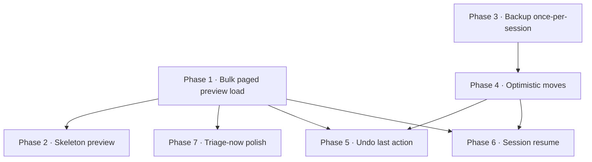

# SPEC — Speed & Triage UX

> Status: DRAFT (spec-first; no code yet)
> Author: drafted with Claude, 2026-06-08
> Scope: post-M1 performance + UX milestone. Independent of M2 (Distillation Engine).
> Branch/PR model: **one phase = one PR**, merged to `main` in dependency order.

---

## 1. Why

M1 ships a correct, keyboard-driven PARA triage TUI — but it stutters. Triage is a
speed game: the user fires single keystrokes and expects the next note instantly.
Today two Apple-Event costs leak onto the user's critical path.

### Measured on real Notes (2026-06-08, 2,405 notes, 92 MB `NoteStore.sqlite`)

| Operation | Cost | Used by |
| --- | --- | --- |
| `count notes of folder` (scoped) | **0.12 s** | inbox count |
| `get id/name of notes of folder` (bulk refs) | **0.11 s** | `get_inbox_note_refs` |
| `get body of note id "…"` (by **global id**) | **0.80 s** | **current per-note preview load** |
| `get body of first note of folder` (by position) | 0.15 s | — |
| `get body of notes of folder` (**bulk, 107 notes**) | **0.35 s total** (~0.003 s/note) | *proposed* |
| `count notes` (all 2,405, global scan) | 2.42 s | — (avoid) |
| Backup copy before every move | **92 MB**, synchronous on UI thread | `BackingUpNotesRepository` |

### Two root causes

1. **Skip lag** — previews are fetched **by global id** (0.80 s each), and the
   prefetch chain in `screens/sort.py` only re-arms when a *cold* load completes for
   the *current* index (`_apply_note_body` → `_prefetch_next`). After the single
   look-ahead note is consumed the chain dies, so ~every other skip eats the full
   0.80 s as `Loading preview…`. Bulk-fetching the same bodies is **~230× cheaper per
   note** (0.35 s for 107 vs 0.80 s for one).

2. **Move lag** — every move copies the whole 92 MB DB *before* the write,
   *synchronously on the event loop*. Over a 100-move session that's up to ~9 GB of
   churn and a visible freeze on each move.

## 2. Goals / non-goals

**Goals**
- No Apple Event ever blocks a keystroke on the user's critical path.
- Skipping and moving both feel instant on an inbox of a few hundred notes.
- Graceful, legible feedback when an inbox is large enough that previews stream in.
- Preserve the non-destructive guarantee: a restore point still exists before writes.

**Non-goals**
- M2 Distillation work.
- Replacing the AppleScript bridge (persistent osascript / JXA) — deferred; bulk
  loading makes call-count low enough that it's not worth it yet.
- Editing notes from the TUI.

## 3. Architecture principles (apply to every phase)

- **Refs-first.** The fast `get_inbox_note_refs` (~0.11 s) gives id+title for the whole
  inbox up front. The title renders instantly; the user can act before any body loads.
  `len(refs)` is the inbox size — no separate count call.
- **Bodies are cosmetic.** Moves/skips only need `note.id`. Body/preview load must never
  gate a keystroke.
- **One cache, filled in the background.** `_note_cache: dict[id → Note]`, populated by a
  background worker; a per-note by-id `get_note` remains the cache-miss fallback.
- **Large-inbox threshold = 250 notes.** Below it, a single bulk call (~sub-0.5 s) loads
  silently. At/above it, page the load and show a non-blocking streaming indicator.

---

## 4. Phases (each = one PR)

Dependency order. Phase N assumes 1…N-1 are merged unless noted.

P1 and P3 are independent roots and can be built in parallel / merged in either order.

---

### Phase 1 — Bulk, paged preview load + streaming indicator  `[PERF-BULK]`
**The core skip-lag fix.** Replaces per-note by-id preview loading with a background
bulk load aligned to the refs.

**Changes**
- `sorter/notes.py`: add to `NotesRepositoryProtocol` + `AppleScriptNotesRepository`:
  - `get_inbox_note_bodies(offset: int, count: int) -> list[Note]` — fetch a contiguous
    page of inbox notes **in folder order** (aligned to `get_inbox_note_refs` order) via
    one AppleScript range read (`body of notes (a thru b) of folder …`, with id+name in
    the same call so each `Note` is fully populated). Page bodies, not the whole inbox,
    so a 1,000-note inbox doesn't materialize at once.
  - `BackingUpNotesRepository`: pass-through (read op, no backup).
- `screens/sort.py`:
  - After `_apply_inbox_refs`, start a background **bulk-load worker**:
    - `len(refs) ≤ 250` → single page `(0, len)`, no indicator.
    - `len(refs) > 250` → pages of 200, **first page first**, then the rest; update a
      non-blocking `#progress`-adjacent line `Loading previews… N/M`, cleared on
      completion.
  - Each landed page merges into `_note_cache`; re-render the current note iff its body
    just arrived.
  - **Retire** the broken `_prefetch_next` single-hop chain; keep `_get_or_kick_note`'s
    by-id `get_note` only as the cache-miss fallback (skip-faster-than-load, or a page
    that errored).

**Success criteria**
- On a ≤250 inbox, every preview after the first ~0.5 s renders with no `Loading…` flash.
- On a >250 inbox, skipping never blocks; the indicator counts up and disappears.
- Cold-note fallback still resolves a single preview via `get_note`.

**Tests** — `get_inbox_note_bodies` parsing/order/paging (unit, mocked osascript);
Pilot test: refs→bulk pages populate cache, indicator lifecycle, cache-miss fallback.
`notes.py` is a write-path-adjacent read module → keep ≥95% on new bridge methods.

**Risk** — AppleScript range syntax/order correctness (must match refs order exactly).
Mitigation: assert id alignment between refs and bodies in the worker; fall back to by-id
on misalignment.

---

### Phase 2 — Skeleton / shimmer preview  `[UX-SKELETON]`
Replace the literal `Loading preview…` string with a dim skeleton so a pending preview
reads as "coming," not "stuck."

**Changes** — `screens/sort.py` `_render_current_note`: when body not yet cached, render a
muted multi-line placeholder (Textual styling in `app.tcss`); swap to real preview on load.
**Depends on** Phase 1 (loading states exist). Pure UI, no bridge change.
**Success criteria** — no raw "Loading preview…" text; placeholder visually distinct/dim.
**Tests** — Pilot snapshot/state assertion that placeholder shows pre-load, preview post-load.

---

### Phase 3 — Backup once-per-session  `[BKUP-CADENCE]`
Trade "restore point before *every* write" for "restore point before the *first* write of
a session." ~100× less churn; removes most of the move freeze even before Phase 4.

**Changes**
- `backup.py` `BackingUpNotesRepository`: gate `create()` on a per-session
  "already backed up" latch (e.g. `_session_backed_up: bool`, set on first successful
  backup; reset via an explicit `begin_session()`/new instance per SortScreen visit).
  Keep `auto_backup_on_write` as the master switch.
- Update threat-model notes (T-04-09 / T-06-04): mitigation becomes "a restore point is
  captured before the first write of each session," documented in `backup.py` + CLAUDE.md.
- `config`: optional `backup_cadence: "session" | "write"` (default `"session"`) so the
  old behavior is recoverable.

**Success criteria** — exactly one backup dir per session regardless of move count; a
fresh session creates a new one. No write proceeds if that first backup fails (BKUP-06
preserved for the session's first write).

**Tests** — write-path module → **95% floor**. Unit: N moves → 1 `create()` call; first-
backup failure aborts first write; new session → new backup. Update existing backup tests.

**Risk** — weaker rollback granularity (can't roll back to mid-session). Accepted: triage
is non-destructive (moves, never deletes) and undo (Phase 5) covers per-action reversal.

---

### Phase 4 — Optimistic moves  `[PERF-MOVE]`
Make a move feel as instant as a skip: show `moved ✓`, advance immediately, run
backup+move on a worker thread behind the user.

**Changes**
- `screens/sort.py` `_handle_move`: render the moved confirmation + `_advance()`
  synchronously; dispatch the actual `router.handle_*` → `ensure_folder`/`move_note`
  (+ first-write backup) to a `@work(thread=True)` worker.
- On worker failure (`NotesOSError`): surface a non-blocking toast/`notify`, record the
  error, and re-insert the note id into a "needs attention" tail (do **not** silently
  drop). Keeps T-06-05 (one bad note never aborts the session).
- Guard ordering: advancing the index must not race the worker reading note id — capture
  id/folder_path before dispatch.
**Depends on** Phase 3 (so the off-thread write is cheap and single).
**Success criteria** — no UI freeze on move; failed moves are visibly reported and the
note isn't lost; session counts stay correct under rapid moves.
**Tests** — write-path 95%. Pilot: rapid moves don't freeze; injected move failure →
error recorded + surfaced + note retained; counts correct.
**Risk** — concurrency/ordering. Mitigation: one in-flight write worker, queue or serialize.

---

### Phase 5 — Undo last action (`U`)  `[UX-UNDO]`
Reverse the last skip or move. Confidence → speed: users stop second-guessing.

**Changes**
- `sorter/session.py`: track an undo stack of `(note_id, prev_state, outcome, dest?)`.
- `sorter/notes.py`: a move-back uses existing `move_note(note_id, original_folder)`
  (origin = inbox folder). Add capture of the source folder at move time.
- `screens/sort.py`: bind `U`; on undo, move the note back (off-thread, like Phase 4),
  decrement the relevant counter, step `_index` back to that note, re-render.
- Edge cases: nothing to undo (no-op + hint); undo of a skip just steps back (no write);
  undo after session finish.
**Depends on** Phase 4's off-thread write plumbing (reuse it); Phase 1's cache.
**Success criteria** — `U` restores the previous note to the inbox and the screen; counts
correct; works for both skip and move; bounded stack (≥ last 1, ideally full session).
**Tests** — Pilot: move→undo restores note+count+position; skip→undo; undo with empty
stack; undo move failure surfaced. Write-path 95% on the move-back.
**Risk** — restoring exact original folder (note may have come from a subfolder of inbox).
Mitigation: capture full source `FolderPath` at move time.

---

### Phase 6 — Session resume  `[UX-RESUME]`
Quit at note 80 of 200, resume there next launch.

**Changes**
- Persist lightweight progress (inbox folder, last-processed index or last note id,
  session counts) to `~/.notes-os/session-state.json` on advance/quit.
- On SortScreen mount, if a saved position matches the current inbox refs (by id), offer
  "Resume at N / Start over" (single-select modal); resume sets `_index` accordingly.
- Invalidate cleanly when the inbox changed materially (ids no longer match).
**Depends on** Phase 1 (refs/index model) and Phase 4 (stable advance semantics).
**Success criteria** — relaunch after partial session offers resume to the right note;
"start over" clears it; stale state is ignored safely.
**Tests** — unit: save/load round-trip, stale-detection. Pilot: resume vs start-over paths.
**Risk** — drift between saved index and a changed inbox. Mitigation: match by note id, not
position; fall back to start-over.

---

### Phase 7 — Triage-immediately polish  `[UX-TRIAGE-NOW]`
Tiny: guarantee nothing on the *action* line ever looks blocked. The category prompt is
live the instant the title shows; only the preview pane may show a placeholder.

**Changes** — `screens/sort.py`: ensure `#prompt` renders the live category prompt on
first paint (not gated on body load); audit any state where the action line shows a
loading/empty string while input is actually accepted.
**Depends on** Phase 1. Could be folded into Phase 1's PR if you prefer fewer PRs — kept
separate per the one-feature-one-PR request.
**Success criteria** — from first paint, P/A/R/X/S are accepted and the prompt reflects it,
even while previews stream.
**Tests** — Pilot: key accepted at AWAIT_CATEGORY before any body load completes.

---

## 5. Cross-cutting

- **Coverage:** write-path modules (`notes.py`, `backup.py`, move-back) keep the **95%**
  floor; others 80%. Overall CI gate ≥80%.
- **Standards:** `from __future__ import annotations`, mypy strict, Ruff full ruleset,
  zero `print()`, Pydantic V2 frozen models, `pathlib`, DI/Protocol — per CLAUDE.md.
- **All AppleScript mocked** in unit tests; integration tests `@pytest.mark.integration`,
  macOS-only, `_TestInbox`.

## 6. Open questions
1. Page size (200) and threshold (250) — confirm against a real large inbox before locking.
2. Undo stack depth — last-action only, or full-session? (Spec assumes full-session.)
3. Resume prompt — auto-resume silently vs always ask? (Spec assumes ask.)
4. Keep `backup_cadence: "write"` escape hatch, or drop it and commit to per-session?

## 7. Suggested merge order
`Phase 1 → Phase 2 → Phase 7` (read/UX track) and `Phase 3 → Phase 4` (write track) can
proceed in parallel; then `Phase 5` and `Phase 6` once both tracks have landed.
