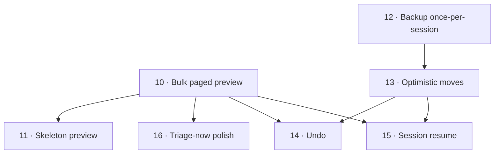

# Roadmap — Milestone v3.0 "Speed & Triage UX"

> Milestone-scoped (additive). Does NOT replace the root `ROADMAP.md` — kept
> separate to avoid collisions with the parallel v2.0 effort on `cool-crane`.
> Merge into root planning when v2.0 and v3.0 reconcile on `main`.
>
> Requirements: `.planning/milestones/v3.0-speed-triage-ux-REQUIREMENTS.md`
> Design + measured baselines: `.planning/SPEC-speed-and-triage-ux.md`

## Overview

Two independent tracks, one PR per phase:

- **Read/UX track:** Phase 10 → 11 → 16
- **Write track:** Phase 12 → 13

Tracks run in parallel; **Phase 14 (Undo)** and **Phase 15 (Resume)** land last
(each depends on both a warm cache from 10 and the off-thread write plumbing from 13).

## Phases

| # | Phase | Goal | Requirements | Depends on |
|---|-------|------|--------------|-----------|
| 10 | Bulk paged preview load | Kill skip-lag: previews load in background, never block a keystroke | PERF-01, PERF-02, PERF-03 | — |
| 11 | Skeleton preview | Pending previews read as "coming," not "stuck" | UX-01 | 10 |
| 12 | Backup once-per-session | One restore point per session, not per write | BKUP-07, BKUP-08 | — |
| 13 | Optimistic moves | Moves feel instant; backup+move run off the event loop | PERF-04, PERF-05 | 12 |
| 14 | Undo last action | Reverse the last skip/move with `U` | UX-02 | 10, 13 |
| 15 | Session resume | Resume an interrupted session at the right note | UX-03 | 10, 13 |
| 16 | Triage-now polish | Action line never looks blocked | UX-04 | 10 |

## Phase details

### Phase 10 — Bulk paged preview load  `[PERF-BULK]`
**Goal:** Replace per-note by-id preview loading (0.80 s each, broken prefetch chain) with a background bulk load aligned to refs (~0.35 s / 107 notes measured).
**Requirements:** PERF-01, PERF-02, PERF-03
**Success criteria:**
1. On a ≤250 inbox, previews after the first ~0.5 s render with no "Loading" flash.
2. On a >250 inbox, skipping never blocks; the `N/M` indicator counts up and disappears on completion.
3. A cold note (skipped faster than the page load) resolves its preview via the single-note `get_note` fallback.
4. New `get_inbox_note_bodies(offset, count)` returns bodies in folder order, id-aligned to `get_inbox_note_refs`.

### Phase 11 — Skeleton preview  `[UX-SKELETON]`
**Goal:** Swap the literal "Loading preview…" string for a dim skeleton placeholder.
**Requirements:** UX-01
**Success criteria:**
1. A note whose body isn't cached shows a visually distinct, dim multi-line placeholder.
2. The placeholder is replaced by the real preview the moment the body lands.
3. No raw "Loading preview…" text remains anywhere in the sort flow.

### Phase 12 — Backup once-per-session  `[BKUP-CADENCE]`
**Goal:** Capture a restore point before the first write of a session instead of before every write (~100× less churn).
**Requirements:** BKUP-07, BKUP-08
**Success criteria:**
1. N moves in one session produce exactly one backup directory; a new session creates a new one.
2. `backup_cadence` config (`session` default | `write`) selects behavior; default is `session`.
3. A failed first-write backup still aborts that write (BKUP-06 invariant holds for the session's first write).
4. Threat-model notes (T-04-09 / T-06-04) updated in `backup.py` and CLAUDE.md.

### Phase 13 — Optimistic moves  `[PERF-MOVE]`
**Goal:** Show `moved ✓` and advance instantly; run backup+move on a worker thread.
**Requirements:** PERF-04, PERF-05
**Success criteria:**
1. Rapid moves never freeze the UI.
2. An injected move/backup failure is surfaced (toast/notify), the error is recorded, and the note is retained — session continues (T-06-05 preserved).
3. Session move/skip/error counts stay correct under rapid input.

### Phase 14 — Undo last action  `[UX-UNDO]`
**Goal:** `U` reverses the last skip or move.
**Requirements:** UX-02
**Success criteria:**
1. Undo of a move returns the note to its original folder and back into the sort position; move count decrements.
2. Undo of a skip steps back to that note (no write); skip count decrements.
3. `U` with nothing to undo is a no-op with a brief hint.
4. The source `FolderPath` is captured at move time so restore targets the true origin.

### Phase 15 — Session resume  `[UX-RESUME]`
**Goal:** Resume an interrupted session at the right note.
**Requirements:** UX-03
**Success criteria:**
1. Relaunch after a partial session offers "Resume at N / Start over"; resume lands on the correct note (matched by id).
2. "Start over" clears saved progress.
3. A materially changed inbox (ids no longer match) is detected and falls back to start-over safely.

### Phase 16 — Triage-now polish  `[UX-TRIAGE-NOW]`
**Goal:** Guarantee the action line is never gated on body load.
**Requirements:** UX-04
**Success criteria:**
1. From first paint, P/A/R/X/S are accepted while previews stream.
2. The `#prompt` line shows the live category prompt on first paint, never a loading/empty string while input is accepted.
> Could fold into Phase 10's PR if fewer PRs are preferred; kept separate per one-feature-one-PR.

## Coverage check

9 requirements → 7 phases, every requirement mapped exactly once. ✓

## Next step

Per phase, when ready to build (after reconciling milestone state with `main`):
`/gsd-plan-phase 10` → produces `.planning/phases/10-perf-bulk-preview/10-01-PLAN.md`.
